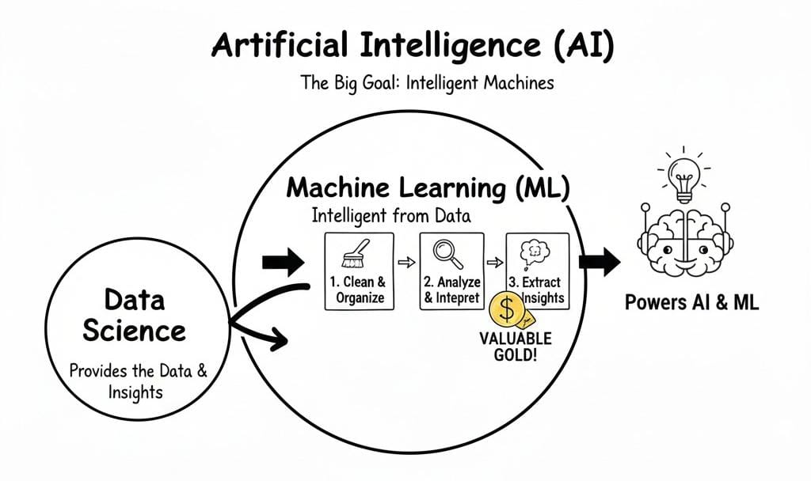
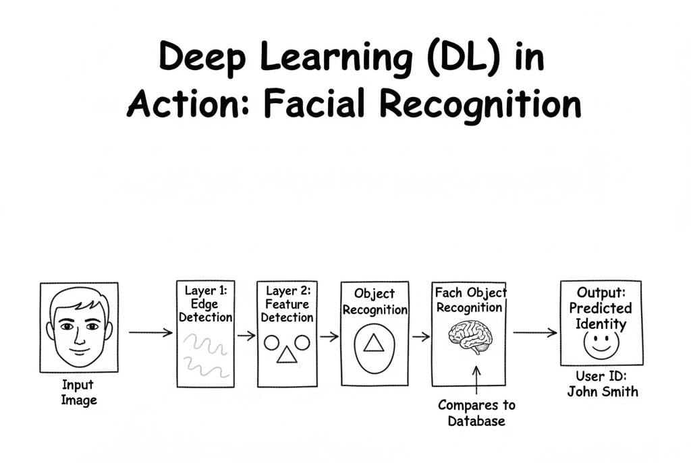
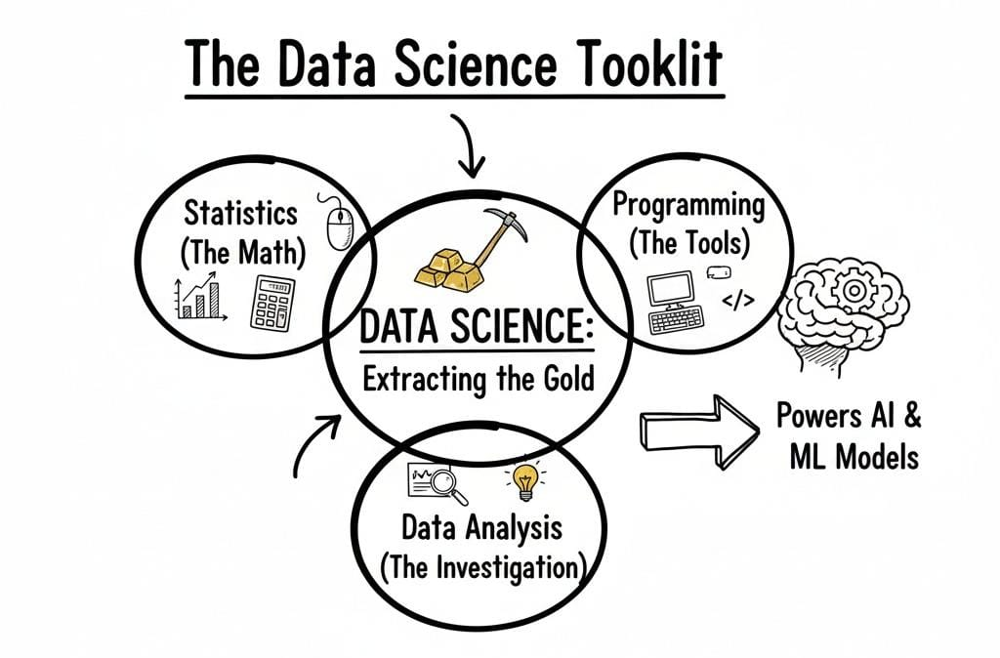
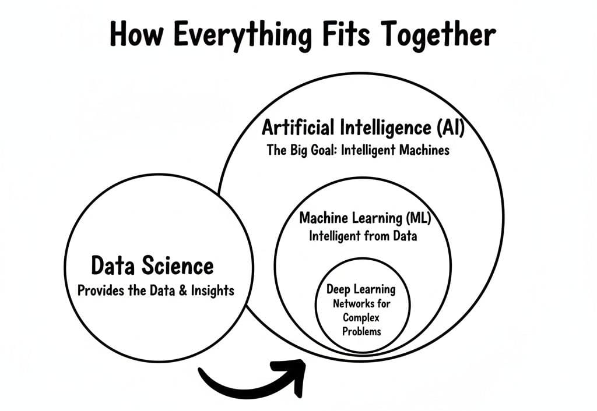

# The AI Revolution: A Beginner’s Guide to AI, ML, DL, and Data Science

Artificial Intelligence (AI) is no longer a futuristic idea that belongs only in science-fiction movies. It has quietly become part of our everyday lives. From the songs Spotify suggests to the shows Netflix recommends, from Google Maps choosing the fastest route to your phone unlocking when it sees your face, AI is shaping countless small decisions we make every day.

But while AI is everywhere, what actually happens behind the scenes is still a mystery to many. Words like Machine Learning, Deep Learning, and Data Science are often used interchangeably, even though they mean different things. To truly understand this digital revolution, we need to look at how these four ideas connect and support one another.

## 1. Artificial Intelligence (AI): The Big Picture

Artificial Intelligence is the broadest and most powerful idea in this entire field. At its core, AI refers to machines that are designed to imitate human intelligence. This does not just mean doing calculations faster, but actually making decisions, solving problems, understanding language, recognizing images, and even learning from experience.

Some AI systems work by following strict rules written by humans. These are called rule-based systems. For example, a simple AI might be told: “If the temperature is above 30 degrees, turn on the air conditioner.” The machine does not think or learn—it simply follows instructions.

More advanced AI, however, does not rely only on rules. It learns from data. This is the kind of AI behind self-driving cars, recommendation engines, and voice assistants. These systems observe patterns in large amounts of data and use them to make intelligent choices.

### Additional Examples of AI in Daily Life:
*   **Virtual Assistants:** Siri, Alexa, and Google Assistant use AI to interpret your voice and control your smart home.
*   **Smart Vacuums:** Robot vacuums like the Roomba use AI to navigate around furniture and "decide" which areas need extra cleaning.
*   **Customer Service Chatbots:** Many websites use AI bots to answer your questions instantly at any time of day.

## 2. Machine Learning (ML): Learning from Experience

Machine Learning is a part of AI, but it works in a very special way. Instead of telling a computer exactly what to do in every situation, we give it examples and let it learn for itself.
This is similar to how humans learn. A child is not given a long list of rules to recognize a cat. Instead, they see many cats and slowly learn what makes a cat a cat. Machine Learning works the same way. It looks at data, finds patterns, and improves over time.

### Real-World Examples of Machine Learning:
*   **Email Spam Filters:** Your inbox "learns" to recognize spam by looking at thousands of examples of junk mail and identifying common patterns like suspicious links or phrases.
*   **Dynamic Pricing:** Apps like Uber or airline websites use ML to adjust prices in real-time based on how many people are looking for a ride or a flight.
*   **Credit Scoring:** Banks use ML to analyze your financial history and predict how likely you are to pay back a loan.

## 3. Deep Learning (DL): The Brain Mimic

Deep Learning is a more advanced form of Machine Learning. It uses structures called artificial neural networks, which are inspired by the way the human brain works.
The human brain is made up of billions of neurons that pass signals to one another. Deep Learning models copy this idea in a digital way. They contain layers of connected units that process information step by step. Each layer learns something slightly more complex than the one before it.

### Real-World Examples of Deep Learning:
*   **Facial Recognition:** This uses deep layers to "see" your eyes, then your nose, then your whole face to unlock your phone or tag you in a photo.
*   **Self-Driving Cars:** These cars use deep learning to "see" the difference between a pedestrian, a bicycle, and a stop sign in real-time.
*   **Language Translation:** Tools like Google Translate use deep learning to understand the context of a whole sentence rather than just translating word-for-word.

## 4. Data Science: Extracting the Gold

While AI, Machine Learning, and Deep Learning are about building intelligent systems, Data Science is about working with the raw material that powers them: data.
Every click, every purchase, and every message creates data. But raw data by itself is messy and often useless. Data Science is the process of cleaning, organizing, analyzing, and interpreting this information so it becomes valuable insights.

### Real-World Examples of Data Science:
*   **Healthcare Predictions:** Data scientists analyze thousands of patient records to find early warning signs of diseases before symptoms even appear.
*   **Sports Analytics:** Teams like those in the NBA use data science to track player movements and predict which strategies will win the most games.
*   **Supply Chain Optimization:** Companies like Amazon use data science to predict which products will be popular in certain cities so they can stock them in nearby warehouses before people even order them.

## How Everything Fits Together

The easiest way to understand these fields is to see how they connect. Imagine a set of nesting dolls:

*   **Artificial Intelligence** is the big goal: creating machines that behave intelligently.
*   **Machine Learning** is one of the main ways we achieve that goal by letting machines learn from data.
*   **Deep Learning** is a powerful technique inside Machine Learning that uses brain-like networks to solve complex problems.
*   **Data Science** supports all of them by providing the data and insights that make learning possible.

### Quick Comparison Table

| Field | Core Concept | Everyday Example |
| :--- | :--- | :--- |
| **AI** | Making machines "smart" | A smart thermostat |
| **ML** | Learning from patterns | Netflix's "Because you watched..." |
| **DL** | Using brain-like layers | Identifying objects in a photo |
| **Data Science** | Finding value in data | Predicting a flu outbreak |

## Conclusion

We are living in the middle of an AI revolution. These technologies are not magic; they are built from data, math, and human creativity. Whether it's a doctor using AI to save a life or a map app helping you get home faster, these pillars are shaping a future where technology works more naturally with humans than ever before.
